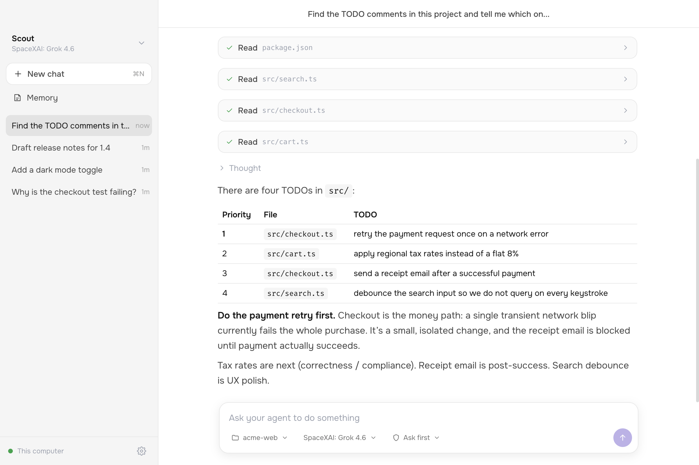
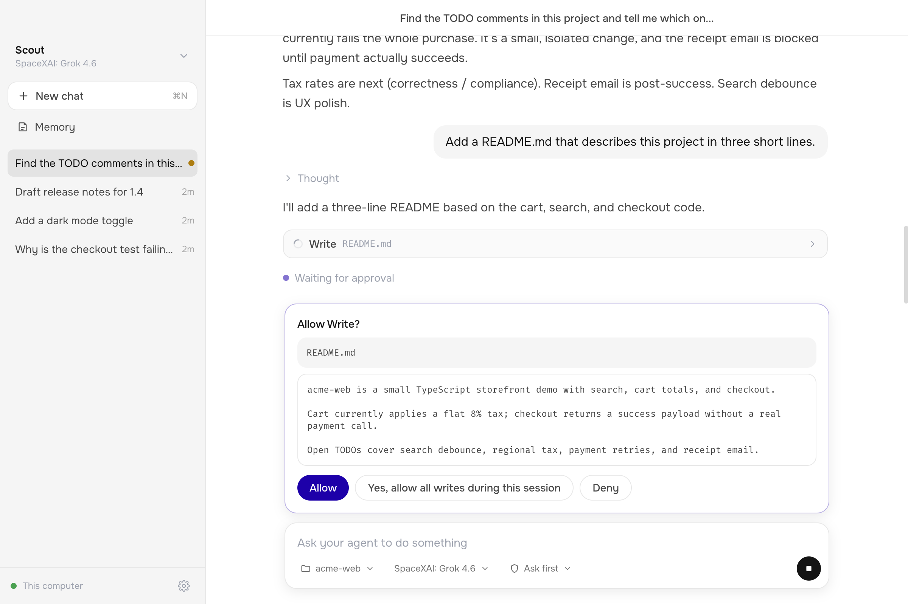
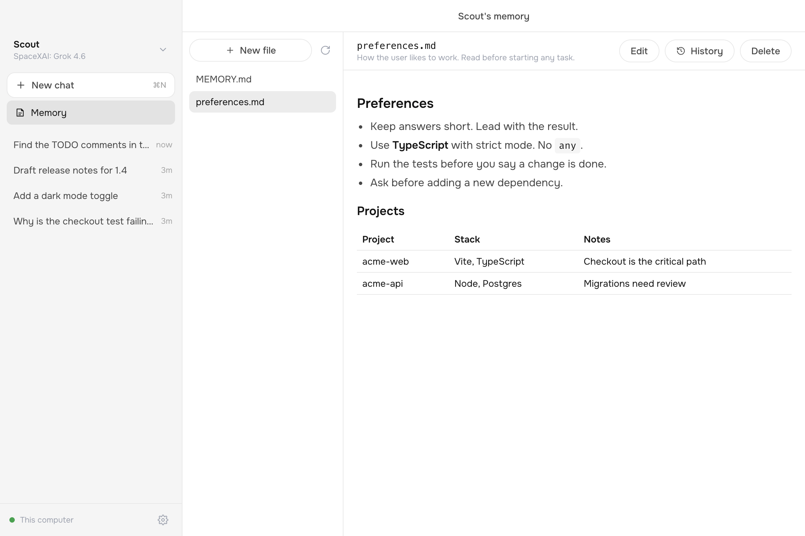

<div align="center">

# OSS-UI

**An open-source desktop app for Letta agents.**

Point an agent at a folder, describe a task, and watch it work.
The agent remembers what it learns across every chat.

[](LICENSE)
[](#build-an-installer)
[](https://docs.letta.com/agent-sdk)

<picture>
  <source media="(prefers-color-scheme: dark)" srcset="docs/images/chat-dark.png">
  
</picture>

</div>

## What it does

OSS-UI is a desktop app for [stateful agents](https://docs.letta.com/concepts/stateful-agents), built on the [Letta Agent SDK](https://docs.letta.com/agent-sdk).

- **Agents on your machine.** By default, agents and their memory are stored on your computer. You do not need an account.
- **Three backends.** Use the local runtime, Letta Cloud, or a Letta app server that you host.
- **Many agents, many chats.** Each agent has its own chats. Your history is there when you come back.
- **You stay in control.** The agent asks before it runs a command or edits a file, and shows you what it will write.
- **Any model.** Connect model providers in the app, then pick a model for each chat.
- **Memory you can read.** See what an agent remembers, edit it, and restore an earlier version.

<table>
  <tr>
    <td width="50%">
      <picture>
        <source media="(prefers-color-scheme: dark)" srcset="docs/images/approval-dark.png">
        
      </picture>
    </td>
    <td width="50%">
      <picture>
        <source media="(prefers-color-scheme: dark)" srcset="docs/images/memory-dark.png">
        
      </picture>
    </td>
  </tr>
  <tr>
    <td align="center">Approve each change, or allow a kind of change for the session</td>
    <td align="center">Read and edit what the agent remembers</td>
  </tr>
</table>

## Quick start

You need [Bun](https://bun.sh/).

```bash
git clone https://github.com/letta-ai/letta-oss-ui.git
cd letta-oss-ui
bun install
bun run dev
```

Then:

1. **Connect a model provider.** The app asks for one the first time. Add an API key, or point to a local server such as Ollama or LM Studio.
2. **Create an agent.** Give it a name and pick a model.
3. **Choose a folder and send a message.** The agent works in that folder.

You can change providers at any time in **Settings > Model providers**. Providers that sign in with a subscription account are connected from the [Letta CLI](https://docs.letta.com/platform/cli): run `letta` and use `/connect`.

## Where your agents live

Open **Settings** (the gear in the sidebar, or `Cmd/Ctrl+,`) to choose a backend.

| Backend            | Agents are stored | Tools run        | You need                    |
| ------------------ | ----------------- | ---------------- | --------------------------- |
| This computer      | On this machine   | On this machine  | A model provider            |
| Letta Cloud        | In Letta Cloud    | On this machine  | A [Letta API key](https://app.letta.com/settings) |
| Self-hosted server | On your server    | On your server   | The server URL              |

To run your own server, see the [App Server docs](https://docs.letta.com/self-hosting/app-server):

```bash
letta server --backend local --listen ws://127.0.0.1:4500
```

Settings are saved in the app's user data folder. API keys and server tokens are encrypted with the operating system keychain when one is available.

In development you can set defaults in a `.env` file. Copy `.env.example` to `.env` and edit it. A value saved in Settings takes priority over the environment.

## Using the app

### Chats

- **Folder.** The folder chip in the message box sets where the agent works. Each chat remembers its folder.
- **Model.** The model chip changes the model for the current chat.
- **Permissions.** The shield chip sets what the agent may do without asking:
  - *Ask first* asks before commands and file edits.
  - *Accept edits* edits files freely and asks before commands.
  - *Full access* runs everything without asking.
- **Chat menu.** Rename a chat, archive it, or copy a command that resumes it in the Letta CLI.

### Agents

Use the agent menu at the top of the sidebar to switch agents or create one. **Agent settings** in that menu lets you rename the agent, change its description, default model, and system prompt, or delete it.

### Memory

The **Memory** button in the sidebar shows the selected agent's memory files.

- You can add, edit, and delete files.
- Each change is saved as a version. **History** shows earlier versions and can restore one.
- Letta checks every change against its memory rules. If a change is not allowed, the app undoes it and tells you why.

## Build an installer

```bash
bun run dist:mac-arm64   # macOS, Apple silicon
bun run dist:mac-x64     # macOS, Intel
bun run dist:linux       # Linux AppImage
bun run dist:win         # Windows portable .exe
```

Installers are written to `dist/`. Builds are not code signed unless you configure signing for [electron-builder](https://www.electron.build/code-signing).

## How it works

```text
React UI  <-- IPC -->  Electron main process  <-- WebSocket -->  Letta app server
(src/ui)               (src/electron)                            (local or remote)
```

- The main process owns one `LettaAgentClient`. For the local and cloud backends it starts one Letta app server (the CLI bundled with the SDK) and shares it across all chats. For the self-hosted backend it connects to your server.
- Each message opens an SDK session on its conversation, streams the turn, and closes the session. Conversations are durable. Sessions are not.
- The SDK's transcript accumulator turns the message stream and the saved history into the same rows, so a chat looks the same live and after a restart.
- Tool approvals go through the SDK's `canUseTool` callback and are answered in the UI.
- Model providers and memory files use app server protocol commands that the SDK does not wrap yet. `src/electron/libs/control.ts` sends them over a second connection to the same server.

`src/electron/types.ts` defines every message that crosses between the UI and the main process.

## Development

```bash
bun run dev        # Start the app with hot reload
bun run check      # Type-check, lint, and run the tests
bun run test       # Run the tests only
bun run build      # Build the UI bundle
```

Tests live in `tests/` and run with [Vitest](https://vitest.dev/). They cover the UI store, the transcript projection, the memory and provider layers, and settings. They do not start Electron or a Letta runtime.

### Upgrading the SDK

`@letta-ai/letta-agent-sdk` and `@letta-ai/letta-code` depend on each other at exact versions. `package.json` pins both in `dependencies` and in `overrides` so that one copy of each is installed. When you upgrade the SDK, change both packages in both places. This command shows which `@letta-ai/letta-code` version an SDK release needs:

```bash
npm view @letta-ai/letta-agent-sdk@<version> dependencies
```

## License

OSS-UI is licensed under the [Apache License 2.0](LICENSE).

It began as a fork of [Open-Claude-Cowork](https://github.com/DevAgentForge/Open-Claude-Cowork) and replaces the Claude SDK with [`@letta-ai/letta-agent-sdk`](https://www.npmjs.com/package/@letta-ai/letta-agent-sdk). See [NOTICE](NOTICE).
